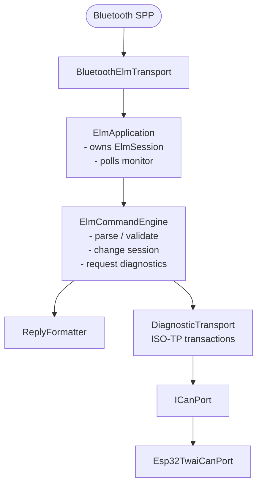
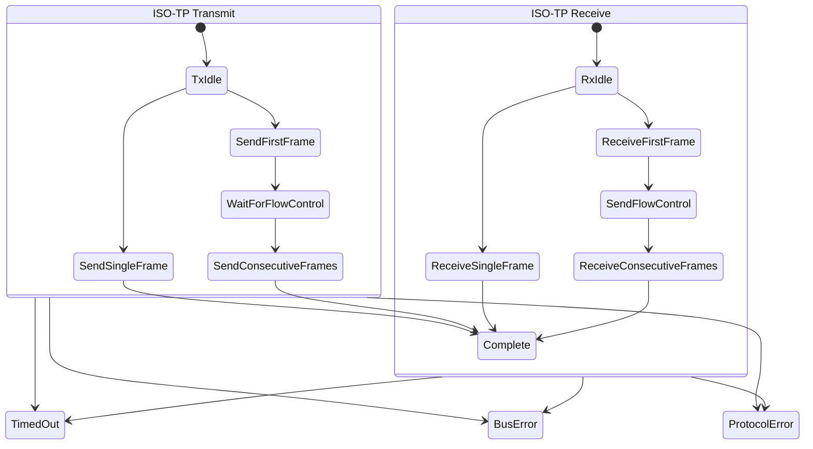

# Architecture

This document describes the target architecture for ESP-OBD. It is a guide
for the reimplementation, not a claim that the current source tree is already
fully split this way.

## Goals

1. A reader can locate a behavior without searching unrelated hardware code.
2. ELM compatibility decisions are explicit and covered by native tests.
3. ISO-TP and CAN behavior are deterministic under a fake clock and fake bus.
4. ESP32-specific code is thin, replaceable, and unable to leak debug data to
   the Bluetooth ELM channel.
5. No task needs a background thread unless it has a real timing requirement.

## Component model

The Bluetooth ELM command path and the UART0 debug console are two entirely
separate paths that never call into each other. They are drawn as two
diagrams for that reason.

### Bluetooth ELM command path



### UART0 debug console path


`DebugConsole` has no line into `ElmApplication`, `ElmCommandEngine`, or
Bluetooth. It is a dead end by design: see Responsibilities below.

`ElmApplication` is the composition root. It is the only component that knows
both about a transport and the command engine. `main.cpp` should only create
the adapters, construct this object, and call `poll()` from `loop()`.

## Dependency rules

Dependencies point inward. A portable layer must not include a platform layer.

| Layer | Owns | May depend on | Must not depend on |
|---|---|---|---|
| `can/` | `CanFrame`, ID helpers, filters | C++ standard library | Arduino, TWAI, ELM |
| `isotp/` | ISO-TP TX/RX state machines | `can/`, `ICanPort`, `IClock` | Bluetooth, `Stream` |
| `diagnostic/` | `DiagnosticTransport`, typed transaction results | `can/`, `isotp/` | `elm/`, Arduino, Bluetooth |
| `elm/` | parser, session, AT commands, replies | `can/`, `diagnostic/` | Arduino, TWAI, Bluetooth |
| `app/` | transport coordination, monitor lifecycle | portable layers and interfaces | ESP32 headers in logic |
| `platform/esp32/` | concrete Bluetooth, UART, TWAI, NVS adapters | ESP32/Arduino APIs and interfaces | portable implementation details |

If a class needs `#ifdef ARDUINO`, it is in the wrong layer unless it is an
ESP32 adapter.

## Core types and interfaces

Use fixed-width, value types. Do not let `String`, `Stream`, `twai_message_t`,
or `esp_err_t` escape an adapter.

```cpp
struct CanFrame {
  uint32_t id;
  bool extended;
  bool remoteRequest;
  uint8_t dlc;
  std::array<uint8_t, 8> data;
};

class ICanPort {
 public:
  virtual bool configure(const CanConfig& config) = 0;
  virtual CanResult send(const CanFrame& frame, Milliseconds timeout) = 0;
  virtual ReceiveResult receive() = 0;  // always non-blocking: a queued frame or NoFrame
  virtual CanStatus status() const = 0;
  virtual ~ICanPort() = default;
};

class IClock {
 public:
  virtual Milliseconds now() const = 0;
  virtual ~IClock() = default;
};
```

`ElmCommandEngine` takes a complete line and returns a structured reply:

```cpp
struct ElmReply {
  ReplyKind kind;              // Text, StartMonitor, StopMonitor, NoReply
  FixedString<...> text;
  bool appendPrompt;
};
```

Separating replies from `Stream` makes parser and formatting tests simple and
prevents Bluetooth-specific behavior from leaking into command logic.

## Responsibilities

### Transport adapters

`BluetoothElmTransport` turns Bluetooth bytes into complete ELM lines and
writes replies and prompts. It owns echo behavior and its fixed input limit.
It never emits a debug log to its client.

`DebugConsole` is UART0-only. It accepts `#` commands and writes `#DBG:` lines.
It does not call the ELM parser and cannot send an ELM prompt.

Both use one reusable `LineReader` value type. `LineReader` merely returns
events (`Line`, `Overflow`, `TimedOut`); it does not know what a line means.

### ELM layer

Split the current broad session module into small files:

| File | Responsibility |
|---|---|
| `elm_session.*` | Session defaults and state only. No parser or CAN I/O. |
| `elm_parser.*` | Normalize input; recognize AT vs. hex requests; validate syntax. |
| `at_commands.*` | One command-family handler per cohesive group. |
| `elm_formatter.*` | Response endings, hex, headers, spacing, prompt decisions. |
| `elm_errors.*` | Maps typed failures to `?`, `NO DATA`, `CAN ERROR`, etc. |

An AT handler returns an action or a typed error. It does not write bytes and
does not call TWAI. For example, `ATSH7E0` returns a state update; `ATMA`
returns `StartMonitor`; `ATSP3` returns `Unsupported` without changing state.

The exact behavior belongs in [ELM Command Behaviour Contract](ELM_COMMAND_BEHAVIOR.md),
not in comments copied across handlers.

### CAN and ISO-TP layer

`can/` contains CAN ID validation, OBD default addresses, acceptance filtering,
and frame value types. It does not assemble messages.

`isotp/` contains small explicit state machines. Each state transition should
be visible in code and testable:



Each edge out of the `Tx`/`Rx` boxes above means "from any state inside this
machine" — a shorthand for the "any state -> TimedOut | BusError |
ProtocolError" rule that applies uniformly to every transmit and receive
state.

Do not use delays inside ISO-TP. `ICanPort::receive()` is always non-blocking;
a state machine's `poll(now)` calls it to pick up whatever has already
arrived and compares `now` against a deadline it computed from `IClock`
itself. This lets a fake clock test timeouts instantly, and it is the only
place a receive deadline is allowed to live — never inside `ICanPort`.

### Diagnostic layer

`diagnostic/` sits between `isotp/` and `elm/`. `DiagnosticTransport` owns the
per-request transaction state: functional vs. physical addressing, responder
collection, and the CAN-only auto-search sequence. It drives the `isotp/`
state machines and returns structured responders or a typed result such as
`NoData`, `Timeout`, `BusError`, or `ProtocolError`. It must not inspect raw
TWAI error codes, and it must not format ELM text — the `elm/` layer maps its
typed result to the exact reply string.

### Platform layer

`Esp32TwaiCanPort` is the only code that converts between `CanFrame` and
`twai_message_t`. It owns driver install/start/stop and creates normal or
listen-only configurations.

`Esp32BluetoothTransport`, `Esp32UartDebugSink`, `Esp32Clock`, and
`Esp32SettingsStore` are similarly thin adapters. They log platform failures
as typed results; they do not decide ELM output text.

## Testing strategy

The tests are organized by the boundary they verify:

| Test kind | Runs on | Verifies | Fakes allowed |
|---|---|---|---|
| Unit | Desktop | parser, formatter, address/filter, ISO-TP transitions | clock, CAN port |
| Contract | Desktop | every row in the command behavior contract | diagnostic transport |
| Integration | Desktop | command -> ISO-TP -> CAN frames -> reply | fake CAN bus + clock |
| Hardware smoke | ESP32 / bench bus | TWAI configuration, Bluetooth connection, physical traffic | none |

Tests should make assertions at the right level. Parser tests assert actions,
not CAN frames. ISO-TP tests assert frames and deadlines, not ELM strings.
Integration tests assert the complete externally visible ELM conversation.

Use builders to keep test data readable:

```cpp
fakeCan.queueRx(CanFrameBuilder::standard(0x7E8)
                    .data({0x06, 0x41, 0x00, 0xBE, 0x1F, 0xB8, 0x10, 0x00}));
expectReply(engine.execute("0100")).toEqual("41 00 BE 1F B8 10\\r\\r");
```

## Implementation sequence

The authoritative, dependency-ordered sequence is the task board in
[docs/tasks/INDEX.md](tasks/INDEX.md); this document does not duplicate it.
In outline: portable CAN types and test fakes come first, then ELM parsing
and reply formatting, then the ISO-TP receive and transmit state machines,
then the diagnostic transaction layer that combines them, then the ESP32
platform adapters, then the Bluetooth/UART transports, then the remaining
CAN command families, and finally compatibility validation.

This is a clean-start reimplementation, not an in-place refactor: the prior
implementation is preserved only for reference in commit `f5c36ed` and carries
no code or tests forward. Each step in the task board lands as its own
reviewable commit rather than one large rewrite.
